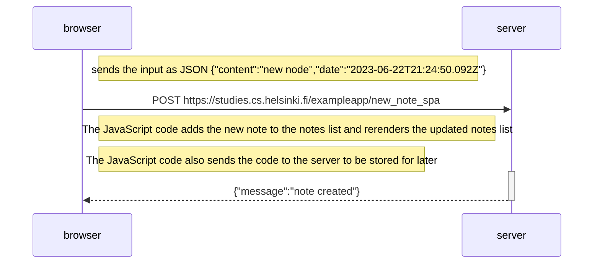

```mermaid
sequenceDiagram
    participant browser
    participant server

    note right of browser: sends the input as JSON {"content":"new node","date":"2023-06-22T21:24:50.092Z"}
    browser->>server: POST https://studies.cs.helsinki.fi/exampleapp/new_note_spa
    note right of browser: The JavaScript code adds the new note to the notes list and rerenders the updated notes list
    note right of browser: The JavaScript code also sends the code to the server to be stored for later
    activate server
    server-->>browser: {"message":"note created"}
    deactivate server
```
